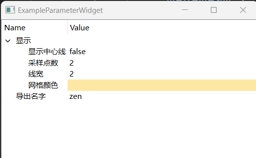

# QParameterWidget
QParameterWidget provides GUI to modify JSON object. The editor of each value could be customized by an simular json-schema file. Supported types are:
- integer
- number
- boolean
- string
- color

# Example

Given JSON:
```json
{
    "Visual": {
        "ShowCenterLine": false,
        "SamplePoints": 2,
        "LineWidth": 2.0,
        "MeshColor": "#fde7a4"
    },
    "ExportName": "zen"
}
```
And JSON-Schema:
```json
{
    "name": "root",
    "title": "全局参数",
    "type": "object",
    "properties": {
        "Visual": {
            "title": "显示",
            "type": "object",
            "properties": {
                "ShowCenterLine": {
                    "type": "boolean",
                    "title": "显示中心线"
                },
                "SamplePoints": {
                    "type": "integer",
                    "title": "采样点数",
                    "minimium": 1,
                    "maximium": 1000,
                    "singleStep": 1
                },
                "LineWidth": {
                    "type": "number",
                    "title": "线宽",
                    "minimium": 1.0,
                    "maximium": 10.0,
                    "singleStep": 1.0
                },
                "MeshColor": {
                    "type": "color",
                    "title": "预浸带颜色2"
                }
            }
        },
        "ExportName": {
            "title": "导出名字",
            "type": "string"
        }
    }
}
```

A customized QParameterWidget is displayed with the following code:

```c++

#include <QParameterWidget/QParameterWidget.h>

#include <nlohmann/json.hpp>
#include <spdlog/spdlog.h>

#include <QApplication>

#include <filesystem>
#include <fstream>

int main(int argc, char **argv)
{
    using zen::QParameterWidget;
    std::filesystem::path src_dir =
        std::filesystem::path(argv[0]).parent_path();
    std::ifstream f(src_dir / "Data/Parameters.json");
    auto param = std::make_shared<nlohmann::ordered_json>();
    f >> *param;

    QApplication app(argc, argv);
    QParameterWidget pw(param, src_dir / "Data/ParametersSchema.json");
    pw.expandAll();
    pw.resizeColumnToContents(0);

    QObject::connect(
        &pw, &QParameterWidget::SigParameterChanged,
        [](const std::string &json_pointer,
           std::shared_ptr<nlohmann::ordered_json> jv) {
            fmt::println(
                "{}: {}", json_pointer,
                jv->at(nlohmann::ordered_json::json_pointer(json_pointer))
                    .dump());
        });
    pw.show();
    app.exec();

    // param is changed with QParameterWidget
    fmt::println("{}", param->dump(4));
    return 0;
}
```

The widget will be like

